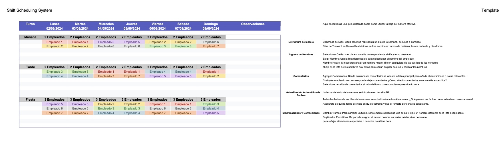

# Shift Scheduling System

*May 2024*

This project applies the logic of automation and data structuring to solve a real business problem: the management of work shifts that was previously done on paper. The system design was based on simplicity and accessibility, demonstrating an approach focused on creating functional solutions for non-technical users.

## Project Focus Areas

*   **Data Structuring:** The system was designed with a logical row and column structure. The implementation of dropdown lists ensures data integrity and simplifies information entry.

*   **Process Automation:** The automatic date update functionality, based on a start date, is an example of process automation. This logic eliminates manual tasks and guarantees data consistency.

*   **User-Centered Solution Design:** The project was developed for users with a low technical skill level. Intuitive design and simple interaction were prioritized to facilitate its use, which indicates a focus on effectively solving problems in a real-world context.

*   **Accessibility and Distribution:** The spreadsheet is shared via a direct link, allowing for real-time access. Permissions are managed within Google Sheets, allowing employees to view the schedule and managers to edit it.

